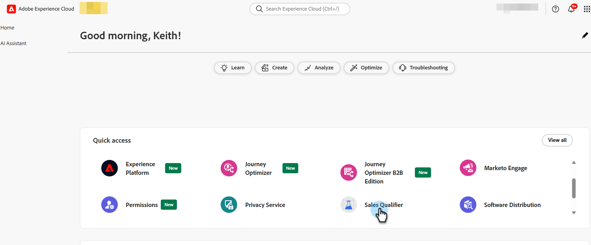

# 会议 {#meetings}

了解您在Adobe Brand Concierge中的所有&#x200B;_会议_&#x200B;设置。 连接日历、设置可用性、查看分析等。

>[!NOTE]
>
>您还可以观看[预约会议](../getting-started/meeting-booking.md)视频。

## 配置 {#configuration}

连接到您的Outlook或Google帐户，并确定各种设置，如星期几、时区和会议持续时间。

### 连接日历 {#connect}

1. 登录到[Adobe Experience Platform](https://experience.adobe.com/){target="_blank"}。

1. 选择&#x200B;**[!UICONTROL 销售限定符]**。

   {width="800" zoomable="yes"}

1. 在&#x200B;_配置_&#x200B;下，单击&#x200B;**配置文件设置**。 在&#x200B;**[!UICONTROL 日历配置]**&#x200B;选项卡中，选择所需的日历。

   

1. 选择已登录的帐户，或添加新帐户。

   

1. 连接完成后，指定所需的电子邮件内容。

   这是收件人预订与您会谈时发送给您的内容。 您还可以包含Microsoft Teams会议链接（可选）。

   

1. 单击&#x200B;**[!UICONTROL 保存]**。

### 设置日历可用性 {#calendar-availability}

1. 单击&#x200B;**[!UICONTROL 日历可用性]**&#x200B;选项卡。

   

1. 选择所需的设置。

   >[!NOTE]
   >
   >若要添加更多时间选项，请单击加号（）。

   

1. 单击&#x200B;**[!UICONTROL 保存]**。

### 设置实时聊天可用性 {#chat-availability}

1. 单击&#x200B;**[!UICONTROL 实时聊天可用性]**&#x200B;选项卡，然后选择所需的设置。 完成后单击&#x200B;**保存**。

   

### 管理成员 {#manage}

**仅管理员**。 查看您的哪些代表已成功连接其日历。

## 活动 {#activities}

单击&#x200B;**[!UICONTROL 会议预订]**&#x200B;以查看已预订的会议，查看已捕获的信息，了解会议计划的时间等等。

### 会议页面 {#bookings}

{width="800" zoomable="yes"}

## Analytics {#analytics}

单击&#x200B;**[!UICONTROL 会议效果]**&#x200B;可查看几种不同的分析类别，包括已请求会议的访客数量以及错过的访客数量。 你可以看到会议的趋势，谁是参加会议的代表，等等。

### “会议”页面 {#performance}

{width="800" zoomable="yes"}
