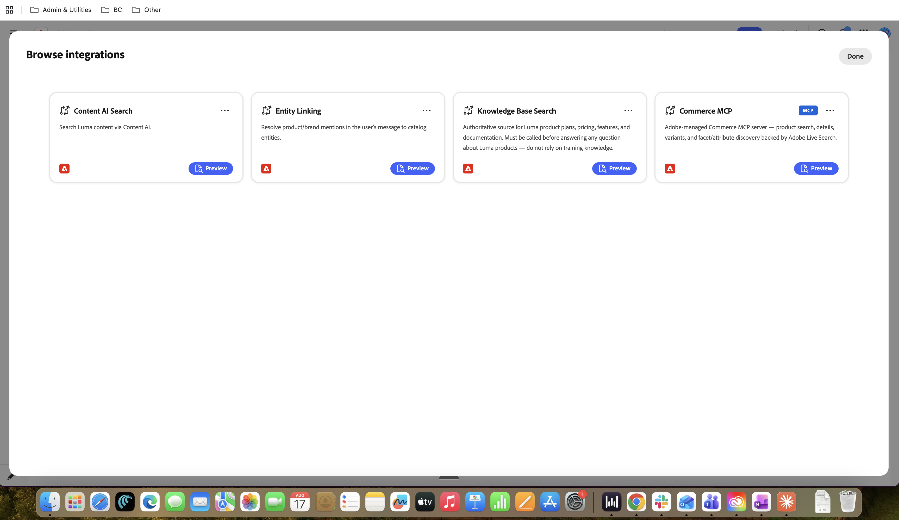

# 技能和集成框架 {#skills-and-integrations}

集成（以前称为工具）是指与数据源或后端的连接。 技能是一种行为。

一种集成可供多种技能使用。 一种技能可使用多种集成。 您可以单独配置这些组件并将它们映射到一起。

## 技能

技能是门房的行为层。 它是一个可重复使用的命名单位，它定义了门房可以执行的单个作业：它处理的内容、它何时进入以及它如何响应。 某个技能本身没有数据；它从附加到该技能的集成中借用功能。

每一项技能都由五个部分组成：

| 部分 | 内容 |
| --- | --- |
| 名称 | 技能的标识符 |
| 描述 | 这种技能的用途是什么，用直白的术语来说，就是它的目的 |
| 使用时机 | 触发条件。 这是路由信号，告知门房何时调用此技能，而不是调用其他技能 |
| 集成 | 此技能允许调用以完成其任务的特定工具。 技能只能使用此处附加的内容 |
| 指令文件 | 有关该技能的行为方式、如何解释请求、如何设置响应格式以及如何应用护栏的详细说明 |

技能在运行时如何表现：当用户消息到达时，平台会将其与每个活动技能的“使用时机”触发条件进行匹配，并将消息路由到匹配的技能。 然后，该技能会运行其指令，并仅调用与其关联的集成。 其说明与品牌个人资料和任何其他有效技能一起构成礼宾员的整体运行时行为。

技能决定做什么以及何时做。 它本身不会连接到任何数据；这是集成的作用。

_站点咨询技能示例_

{width="800" zoomable="yes"}

## 集成

集成是礼宾的功能层。 它是到实际获取数据或执行操作的外部或后端系统（知识库、内容源、实时商务目录）的连接。 在技能就是判断的地方，整合就是能力。

每个集成都具有以下特征：

| 特征 | 它的含义 |
| --- | --- |
| 连接和凭据 | 集成使用自己的配置（例如商业环境ID和API密钥）向其后端进行身份验证。 此配置使其位于正确的数据源 |
| 公开的功能 | 集成使一个或多个可调用功能可用，即技能可调用的单个操作。 例如，Commerce MCP会将产品搜索、产品详细信息、变体和Facet Discovery公开为单独的功能 |
| 可重用 | 一个集成可以附加到多种技能，而相同的集成服务于许多门房和客户。 这种重用是框架的核心效率 |

集成在运行时如何表现：当技能触发并决定它需要数据时，它会调用集成的工具之一。 集成对实时后端执行调用以将结构化数据返回到技能，然后技能会使用这些数据形成其响应。

集成提供了功能，但不执行判断。 它会等待技能调用它并执行它的特定任务，然后返回结果。

### 功能和限制（自助边界）

- **自助服务，无工程：**&#x200B;编辑指令，编辑“使用时机”触发器，附加或分离现有集成，启用或禁用技能，以及连接受支持的集成（例如，使用有效凭据的Commerce MCP）。

- **不是自助服务，需要工程：**&#x200B;创建目录中不存在的全新工具或连接器，添加框架不支持的新护栏类别，或更改后端公开的数据。

- **触发两个技能之间的重叠是配置风险：**&#x200B;如果两个技能可能确实触发同一封邮件，则路由可能不一致。 写入触发程序以避免真正的歧义，而不是依赖路由器来解决歧义。

## 开箱即用的集成

以下是Composer的&#x200B;**Browse集成**&#x200B;面板中显示的四个集成。

| 集成 | 作用 | 注释 |
| --- | --- | --- |
| 知识库搜索 | Source ，了解品牌的产品信息、定价、功能和文档，并通过网站抓取填充 | 此操作会在创建礼宾时自动创建，由站点抓取填充 |
| 内容AI 搜索 | 通过内容人工智能搜索品牌内容 | 替代内容源；通常一次只需要一个知识库搜索或内容AI 搜索 |
| 实体链接/产品目录映射 | 将用户消息中的一个或多个产品品牌提及解析到特定目录实体 | 支持集成，与搜索集成一起使用，而不是单独使用 |
| COMMERCE MCP | Adobe管理的Commerce MCP服务器：产品搜索、详细信息、变体以及Facet/属性发现，由Adobe Live Search提供支持 | 不在基线中；为Commerce用例手动添加 |

{width="800" zoomable="yes"}

## 现成可用的技能

目录中包含四个技能。 每个页面都列出了其推荐的集成。

| 技能 | 它的用途 | 推荐的集成 |
| --- | --- | --- |
| 站点咨询 | 一般品牌问题：策略、常见问题解答、计划、操作方法和支持 | 知识库搜索、内容AI 搜索和实体链接 |
| 产品咨询 | 发现并研究产品：基于名称的产品卡和散文产品问题 | 知识库搜索、实体链接/目录映射 |
| Adobe Commerce目录发现 | 根据实时目录搜索、浏览、筛选和获取有关产品的完整详细信息 | Commerce MCP工具：搜索Commerce产品、产品详细信息、产品变型、产品Facet和可搜索属性 |
| Adobe Commerce产品比较 | Commerce表中两个或多个命名产品的并排比较 | Commerce MCP工具：搜索Commerce产品、产品详细信息 |

这两种商业技能属于仅目录功能，依赖于Commerce MCP集成，该集成不是基线的一部分。 在非商业门房中，网站咨询和产品咨询针对自动创建的知识库搜索运行。

{width="800" zoomable="yes"}

## 门房创建时连接什么

通过一键设置创建门房时，将为您装配基线。

| 创建时布线 | 详细信息 |
| --- | --- |
| 知识库（数据） | 早期抓取通过站点地图将站点的前10页到15页构建成一个知识库。 这是内容存储，不是技能或集成 |
| 知识库搜索（集成） | 内置集成，连接到抓取的知识库并用于对其进行搜索。 抓取不会创建此内容；它指向抓取生成的内容 |
| 站点咨询（技能） | 在基线中处于活动状态，通过有线方式调用“知识库搜索”，以查询抓取的知识库 |

## 常见问题

**技能与集成之间有何区别？**

集成是指与数据源或后端的连接；这是礼宾人员可以联系到的内容，例如知识库或实时商务目录。 技能是一种行为；它决定门房做什么，何时做，以及允许使用哪些集成。

**经验法则：**&#x200B;集成是一种功能；技能是判断何时以及如何使用该功能。

**同一集成是否可以由多个技能使用？**

是的，这是有意为之。 Commerce MCP的工具在目录发现和产品比较中均共享。 构建集成一次，并在多种技能和许多客户中重复使用它，是2.0框架的核心效率；它是删除每位客户的自定义构建的原因。

**从业者是否可以添加无需工程处理的全新功能？**

仅当其集成已存在于目录中时。 从业者可以自由映射、配置和指示任何现有的集成；即自助服务。 但是，如果功能需要尚不存在的后端或连接器（新API或新数据源类型），则首先需要构建集成的工程任务。 一旦它存在于目录中，再次对其进行配置便可自助服务。

**这与BC 1.0的单系统提示有何不同？**

在1.0中，行为由一个大型系统提示（清单）驱动，该提示难以安全编辑，通常需要工程更改。 在2.0中，清单仍然存在，但它是由模块化块组成，而不是写成一个块。 这就是从业者能够配置行为并使单个护栏和指令清晰可审核而不是隐藏在某个提示中的原因。

**提前抓取到底会创建什么？**

该抓取会创建一个知识库，作为网站内容的可搜索存储，从通过网站地图找到的前10到15页构建。 这仅是数据层。 抓取不会创建技能或集成；而是生成用户以后执行操作的内容。

**如果抓取创建知识库，则什么是知识库搜索集成？**

知识库搜索是一种内置的集成，其任务是搜索知识库。 知识库就是数据，知识库搜索就是查询它的功能。 它们是两个不同的东西：一个是内容，另一个是读取内容的工具。 将他们同等对待是一个常见的错误；事实并非如此。

**门房如何在创建时回答一般问题？从头到尾？**

三个层按顺序工作，它们准确地映射到技能、集成和数据模型上：

- 早期抓取从站点的页面（数据）创建知识库。
- 内置的知识库搜索集成可搜索该知识库（集成）。
- “站点咨询”技能专门用于调用“知识库搜索”（行为）。
